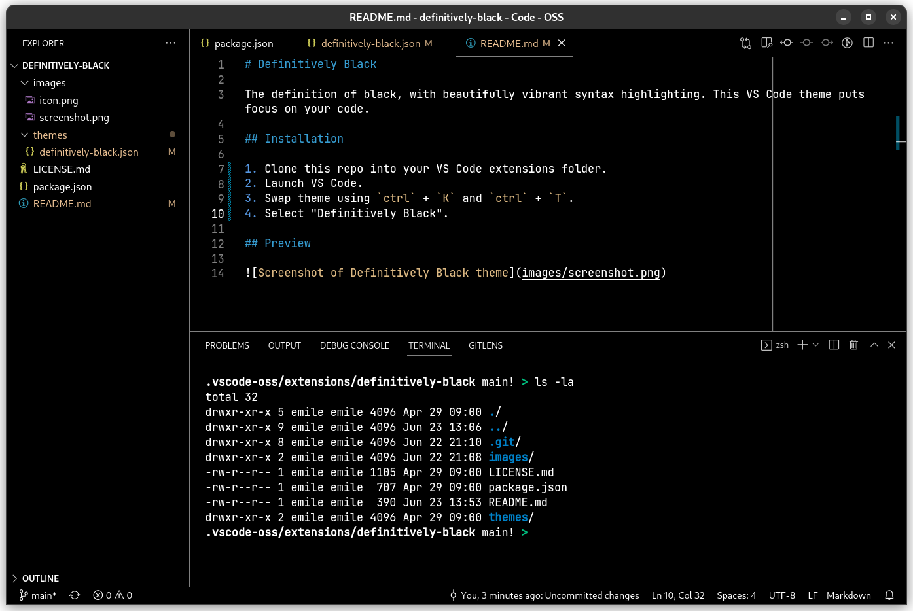

# Definitively Black

A black VS Code theme with beautifully vibrant syntax highlighting.

## Installation

1. Clone this repo into your VS Code extensions folder.
2. Launch VS Code.
3. Swap theme using `ctrl` + `K` and `ctrl` + `T`.
4. Select "Definitively Black".

## Preview

